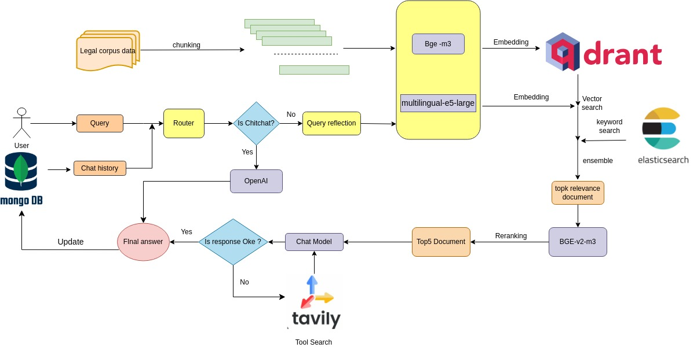
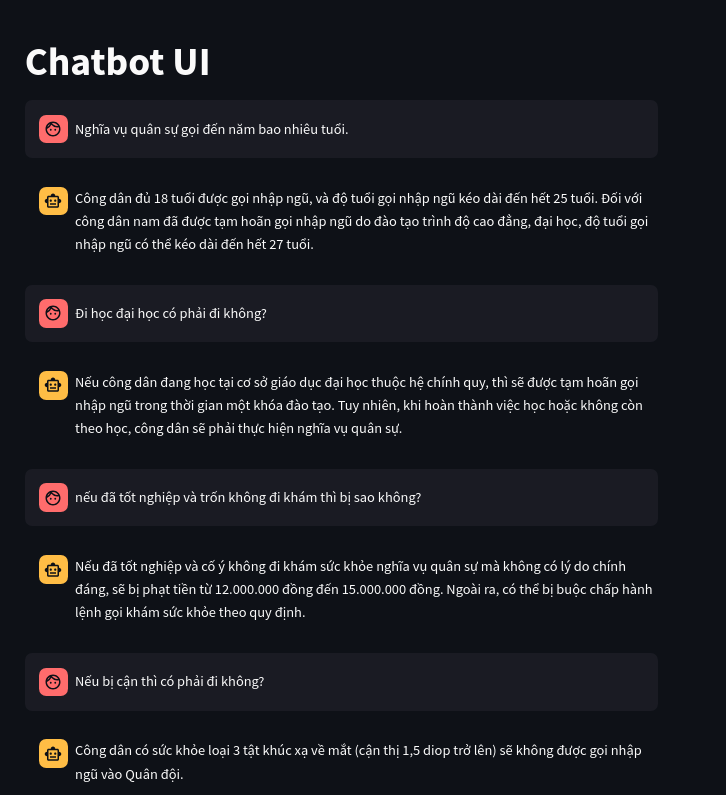

# LLM chat bot - Vietnamese Q&A System in Vietnamese's legal document 
In this project, I build a complete Q&A chatbot related to Vietnamese's legal document

Link dataset : [Link data](https://drive.google.com/drive/folders/1HyF8-EfL4w0G3spBbhcc0jTOqdc4XUhB)

# Table of content

<!--ts-->
   * [Project structure](#project-structure)
   * [Getting started](#getting-started)
      * [Prepare enviroment](#prepare-enviroment)
      * [Running application docker container in local](#running-application-docker-container-in-local)
   * [Application services](#application-services)
      * [RAG (Retrieval-Augmented Generation)](#rag-retrieval-augmented-generation)
        * [System overview](#system-overview)
        * [Build Vector Database and Elasticsearch](#buiding-vectorDB-and-elasticsearch)
        * [RAG flow answering](#rag-flow-answering)
        * [Finetune rerank model](#finetune-rerank-model)
        * [Finetune LLM for answer generation](#finetune-LLM)
   * [Demo](#demo)
<!--te-->

# Project structure
```bash
├── backend                                   
│   ├── requirements.txt                        # backend dependencies for the backend 
│   ├── entrypoint.sh                           # script run backend  
│   ├── src                                     # Source code for the backend
│   │   ├── search_document                             
│   │   │   ├── combine_search.py              # ensemble result from Bge-m3, e5
│   │   │   ├── reranking.py                   # reranking 
│   │   │   ├── search_elastic.py              # Search using elasticsearch
│   │   │   ├── search_with_bge.py             # Search using Bge-m3
│   │   │   └── search_with_e5.py              # Search using Multilingual-e5-large
│   │   ├── agent.py                            # experiment react agent with tool search
│   │   ├── app.py                              # Entry point for the Fast API backend application
│   │   ├── brain.py                            # Logic for intelligent decision-making using OpenAI client
│   │   ├── cache.py                            # Cache implementation for the application
│   │   ├── celery_app.py                       # Celery task queue configuration
│   │   ├── config.py                           # Configuration file for the backend
│   │   ├── database.py                         # Database connection logic
│   │   ├── models.py                           # Database models
│   │   ├── tavily_search.py                    # define tool search internet
│   │   ├── schemas.py                          # Data schemas for API endpoints
│   │   ├── task.py                             # Define task for celery
│   │   └── utils.py                            # Utility functions for the backend                  
├── chatbot-ui                                  # Frontend chatbot application
│   ├── chat_interface.py                       # Chatbot interface logic
│   ├── config.toml                             # Configuration file forchatbot                  
│   ├── entrypoint.sh                           # Entrypoint script for chatbot
│   ├── requirements.txt                        # Python dependencies for chatbot
├── finetune_llm                                # Directory for finetune llm
│   ├── download_model.py                       # download base model          
│   ├── finetune.py                             # finetune LLM for answer generation
│   ├── gen_data.py                             # Code for gen data             
│   ├── merge_with_base.py                      # Merge finetuned weight with base model
│   └── pdf                                     
├── images                                      # Directory for storing image assets
├── retrieval                                   # Retrieval folder
│   ├── FlagEmbedding                           # folder include code finetune
│   ├── hard_negative_bge_round1.py             # search using bge-m3
│   ├── hard_negative_e5.py                     # search using e5
│   ├── create_data_rerank.py                   # create data for reranking   
│   ├── finetune.sh                             # Script to finetuning bge-reranker-v2-m3
│   └── setup_env.sh                            # Script to create env
```
# Getting started

To get starte with this project, we need to do the following

## Prepare enviroment 
Install all dependencies dedicated to the project in local

```bash
python -m venv .venv
source .venv/bin/activate
pip install -r backend/requirements.txt
pip install -r chatbot-ui/requirements.txt
```
Start application .
```bash
sh backend/entrypoint.sh
sh chatbot-ui/entrypoint.sh
```

# Application services 

## RAG (Retrieval-Augmented Generation) 

### System overview



### Build Vector Database and Elasticsearch 
- Because the size of each rule is quite long, the first step will need to be chunked into smaller parts. Then these chunks will be passed through 2 embedding models, Bge-m3 and Multilingual-e5-large, and finally these embedding vectors  will be stored in Qdrant.
- Additionally, these rules are also saved to elasticsearch to enhance the accuracy of retrieval based on lexical matching. 

### RAG flow answering

- **Routing user's intent**: Initially, based on the current query and chat history, determine whether this user's intent is chitchat or law topic. The `gpt-4o-mini` model combined with `few-shot prompting` is used to perform this intent determination. If the user's intent is chitchat, it will go through openai to return the final answer. Else, going to query reflection step

- **Query reflection**: Chat history and current query will be rewritten into a single sentence with more complete meaning for easier retrieval. The model used in this step is `gpt-4o-mini`.

- **Retrieval Relevant Documents:**: The rewritten query will be passed through two embedding models, Bge-m3 and Multilingual-e5-large, then Qdrant will be used to retrieve semantically related documents. Besides elasticsearch is also used for retrieval based on lexical matching. Finally, to avoid losing relevant documents during retrieval, all retrieved documents were merged and duplicates were removed.

- **Reranking:**: If reranking is not used, the number of retrieved documents is quite large. If this entire number of documents is put into ChatModel (as Openai), it may exceed the model's input token limit and be expensive. If the number of documents is small (small top_k), it may lead to the loss of related documents. The topk documents retrieved from the previous step will be passed through the rerank model to re-rank the scores and get the top5 documents with the highest scores.

- **Generating Final Answer**: The LLM combines the top5 documents after reranking step with the user's query and chat history to generate a response. In the prompt for LLM I specified that it will return 'no' if the retrieved document does not contain the answer, so if the response is different from 'no' then it will be the final answer. If the response is 'no' then it will call the search tool in the next step to get more information.

- **Tool call and Generation**: Use the Tavily search tool to search for content on the internet related to the query and then feed this content back to LLM to generate answers.

### Finetune rerank model
Create enviroment 
```bash
cd retrieval
sh setup_env.sh
```
#### Create data finetune
- Train data should be a json file, where each line is a dict like this:

```shell
{"query": str, "pos": List[str], "neg":List[str]}
```
`query` is the query, and `pos` is a list of positive texts, `neg` is a list of negative texts. 
- For each embedding model => will take the top 25 chunks with the highest similarity to each query. If the chunk is in the labeled data, it will be assigned as positive and vice versa, it will be negative => Then the results of these embedding models will be summarized.

- Follow the steps below to create the training dataset

```bash
Step1: cd retrieval
Step2: CUDA_VISIBLE_DEVICES=0 python create_data_rerank.py
```

#### Finetune BGE-v2-m3
Finetune BGE-v2-m3 with parameters: 

    - epochs: 6
    - learning_rate: 1e-5
    - batch_size = 2

Run script for training
```bash
sh finetune.sh
```
### Finetune LLM for answer generation
#### Create + format training data
- The training data will be in conversational format.
```shell
{"messages": [{"role": "system", "content": "You are..."}, {"role": "user", "content": "..."}, {"role": "assistant", "content": "..."}]}
{"messages": [{"role": "system", "content": "You are..."}, {"role": "user", "content": "..."}, {"role": "assistant", "content": "..."}]}
{"messages": [{"role": "system", "content": "You are..."}, {"role": "user", "content": "..."}, {"role": "assistant", "content": "..."}]}
```
- Follow the steps below to create the training + test dataset
```bash
Step1: cd finetune_llm
Step2: python gen_data.py
```
- The number of training dataset are 10000 samples and the number of test dataset are 1000 samples

#### Finetune LLM
- The base model I used for finetune is [1TuanPham/T-VisStar-7B-v0.1](https://huggingface.co/1TuanPham/T-VisStar-7B-v0.1). This model ranks quite high on the VMLU Leaderboard of Fine-tuned Models
- I used the [SFTTrainer](https://huggingface.co/docs/trl/sft_trainer) from trl library to finetune this model. Beside, I user [QLora](https://arxiv.org/abs/2305.14314) technique to reduce the memory footprint of large language models during finetuning, without sacrificing performance by using quantization.

Run script for training
```bash
CUDA_VISIBLE_DEVICES=0 python finetune.py
```
- Below are the results for the training process on WanDB


- Merge weight with model base
Run scrip for merge
```bash
python merge_with_base.py
```

### Evaluate 

The evaluation metrics currently in use are:

- **Recall@k**: Evaluate the accuracy of information retrieval
- **Correctness**:The metric evaluates the answer generated by the system to match a given query reference answer.

The golden dataset I chose for evaluation consists of 1000 samples. Each sample includes 3 fields: query, related_documents, answer


**Recall@k**
|Model               | K=3    | K =5   | K=10    |
|-----------------   |--------|--------|---------|
|BGE-m3              | 55.11% | 63.43% | 72.18%  |
|E5                  | 54.61% | 63.53% | 72.02%  |
|Elasticsearch       | 42.54% | 49.61% | 56.85%  |
|Ensemble            | 68.38% | 74.85% | 80.66%  |
|Ensemble + rerank   | 79.82% | 82,82% | 87.66%  |

**Correctness**

Score is rated on a 5-point scale and has an accuracy of 4.27/5
# DEMO       
